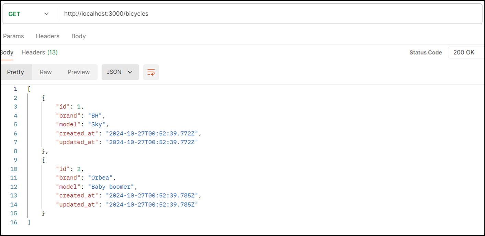
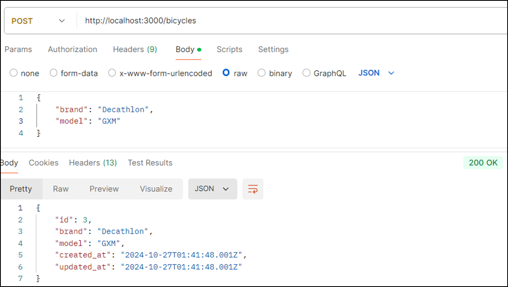
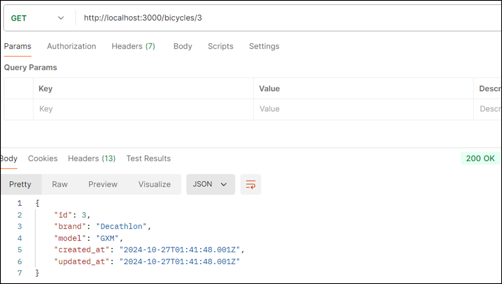
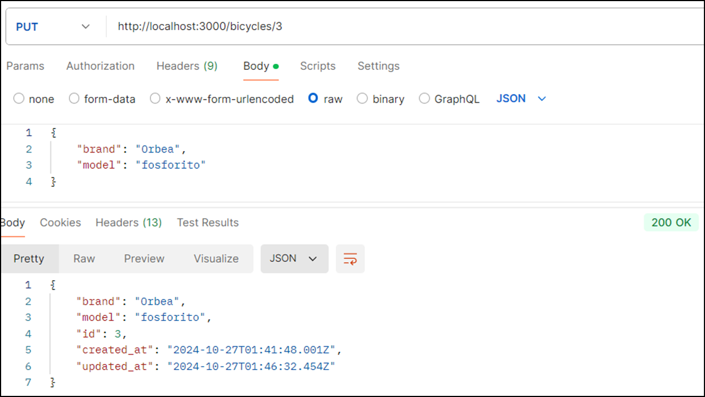
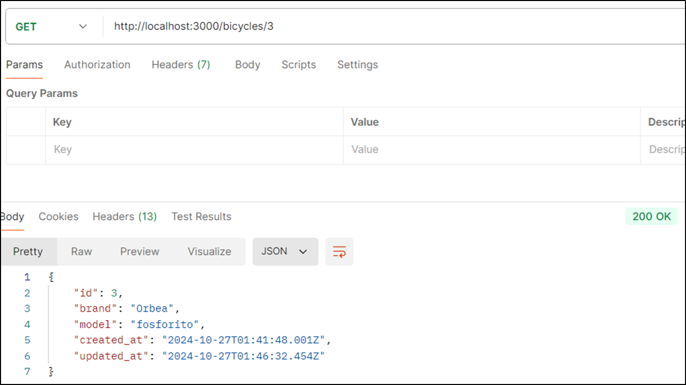
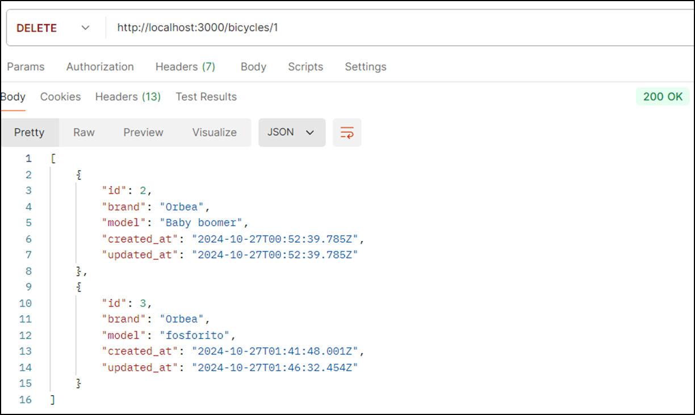

# Rails CRUD example using PostgreSQL running in WSL2 in Windows 11

CRUD Example of an API RESTful using Rails with PostgreSQL running in WSL2 in Windows 11.

## Getting Started

After cloning this project don't forget to:

```
bundle install
```

Start your PostgreSQL database:

````
service start postgresql

Create your .env file and add your database connection data:

```
DATABASE_USERNAME=tiburcio
DATABASE_PASSWORD=sasa
DATABASE_HOST=localhost
DATABASE_PORT=5432
```

Create your database:

```
rails db:create
```

Run the migrations:

```
rails db:migrate
```

Run the seeds:

```
rails db:seed
```

Run your server:

```
rails server
```

Enjoy!!!

## Test your API using POSTMAN

### Get all bicycles:



### Create a new bicycle:



To check that the bicycle has been created show the bicycle with id=3:



### Update the bicycle 3:



To check that the bicycle has been updated show the bicycle with id=3:



### Delete the bicycle 1:



As you can see only bicycles 2 and 3 have been returned because bicycle 1 was deleted.

### Prerequisites

All you need is... some time and...
* Visual Studio Code.
* POSTMAN, for the RESTFul tests.
* More hours than you first could think of...

## Built With

* [Visual Studio Code](https://code.visualstudio.com/) - The Editor used in this project
* [Rails](https://rubyonrails.org/) - Official Ruby on Rails site.
* [PostgreSQL](https://www.postgresql.org/) - The World's Most Advanced Open Source Relational Database

## Acknowledgments

* https://kdshah6593.medium.com/installing-postgresql-with-windows-subsystem-linux-wsl2-4adfa524f86d. Installing PostgreSQL with Windows Subsystem Linux (WSL2).
* https://dev.to/lisahjung/beginner-s-guide-to-creating-an-api-from-scratch-using-rails-2eie. Beginner's guide to creating an API from scratch using Rails.
* https://www.ivanmorgillo.com/2024/06/20/get-started-with-ruby-on-rails-on-wsl2-ubuntu/. Get started with Ruby on Rails on WSL2 Ubuntu.
* https://medium.com/@vitalismutwiri/deploying-a-ruby-api-only-app-on-render-2177f787be74. Deploying a Ruby API-Only App on Render.
* https://www.getpostman.com/. Used to test the RESTFul end points of the project.
* https://gist.github.com/PurpleBooth/109311bb0361f32d87a2. A very complete template for README.md files.
